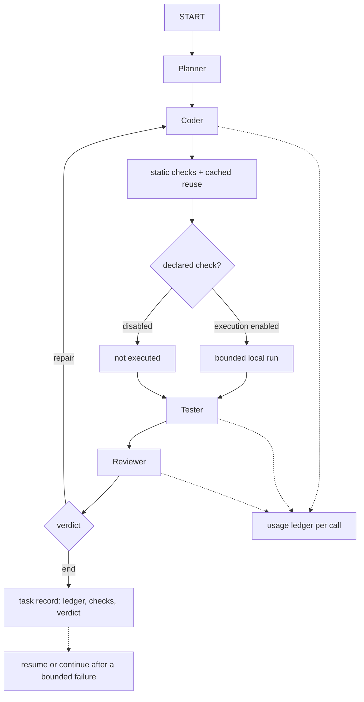
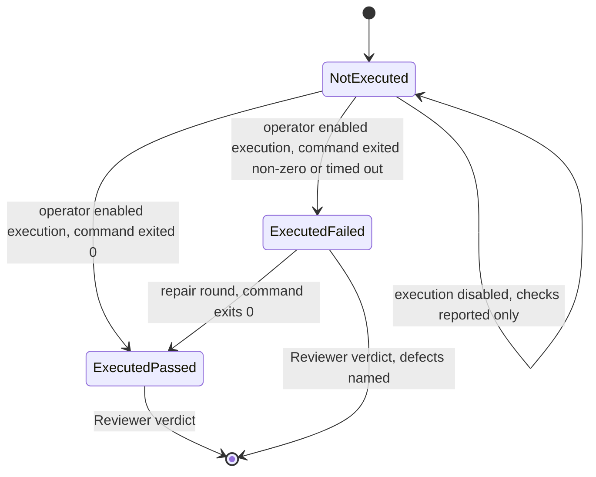
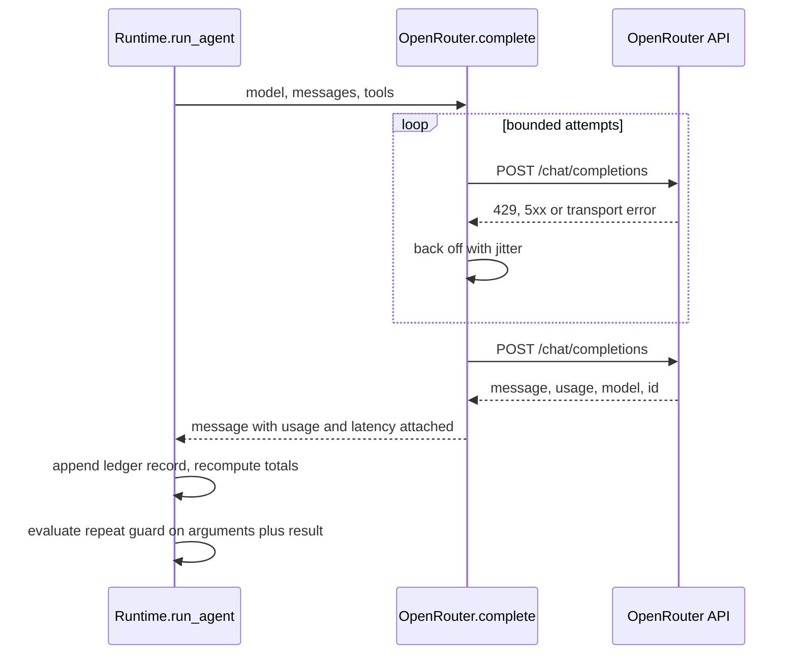

# Axiom Harness Efficiency and Autonomy - Plan

## Goal Capsule

- **Objective:** A run of the Axiom pipeline reaches a verdict the operator can trust at a lower token, dollar and wall-clock cost, finishes more often without the operator stepping in, and reports honestly which parts of the result were actually executed.
- **Means:** four bounded changes inside the existing LangGraph harness — a usage ledger, a cheaper inspection surface, a declarative execution runner, and bounded recovery (KTD1–KTD12).
- **Product authority:** the operator of this local harness decides the cost and safety trade-offs, and the Product Contract below is the authority for behaviour while the Key Technical Decisions are the authority for mechanism. Where the two disagree, the requirement wins on behaviour and the decision wins on mechanism inside it.
- **Execution profile:** `execution: code`, four feature units plus one documentation unit, each landing as its own commit on a branch off `main`.
- **Stop conditions:** stop and report rather than work around — if recording usage requires a second provider call, if honest execution labelling cannot be preserved, or if a unit's test scenarios cannot be written against the existing mock-provider test style.
- **Scope authority:** this plan treats the harness as one work unit; the evaluation programme listed in Scope Boundaries is context, not active scope.
- **Finishing and shipping:** this run finishes with a locally verified change set and leaves it for the operator to inspect. It does not push, open a pull request, or watch CI.
- **Open blockers:** none.

## Product Contract

### Summary

The harness starts measuring what each model call costs, gives agents a cheaper way to inspect and change code, runs the project's own declared checks when the operator permits it, and recovers a run that a crash or a bounded failure would otherwise abandon. Each part stands on its own; together they move cost and time per verified delivery rather than token count alone.

### Problem Frame

The pipeline already finishes small builds and produces an approved verdict, but its own run history reads as a list of harness failures rather than product failures: output-limit truncations, round ceilings that counted inspection, empty completions, an exhausted provider balance, and a Coder that repeated one edit until a guard stopped it.
Two structural causes sit behind most of that list.

The first is that the harness cannot see its own cost.
`backend/provider.py` keeps only the assistant message and the finish reason from a provider response, so token usage, the resolved model, the generation ID and the latency are discarded at the moment they arrive.
The local task store therefore holds no cost column at all, and the historical record cannot be reconstructed afterwards — the analysis in `docs/research/2026-09-16-token-harness-analysis.md` had to reason from character counts and file sizes, which are not tokens.

The second is that the harness never executes what it builds.
`backend/workspace.py` parses Python, JSON, JavaScript and inline HTML and nothing else runs, so imports, assets, camera behaviour, collisions and restart paths stay unverified until a human plays the result.
Every defect the operator actually felt in the two benchmark games was found by the operator, not by the pipeline, while the pipeline reported static checks as the only evidence it had.

Those two causes make the cost of a run invisible and the quality of a run unverified, and both push work back onto the operator: a failed run is retyped or continued by hand, and a finished run is judged by hand.

### Key Decisions

- **Measure before optimising.** The ledger is built first and carries no behaviour change, because the repository currently has no provider usage to reason from and every later claim about cost needs a baseline. Governs R1, R2, R3.
- **The model chooses an intent, never a command line.** Execution is exposed as a small set of named intents the runtime resolves into commands, so generated code cannot compose an arbitrary shell invocation. Governs R11.
- **Execution is opt-in and labelled.** Nothing is executed until the operator enables it, and the task, the API and the dashboard always say which of not-executed, executed-and-failed, or executed-and-passed applies. Governs R12, R13.
- **Reused verification is still verification, and still static.** A recorded parse result may be returned while the file bytes and validator version are unchanged, but it is labelled as reused and never described as a fresh check or as runtime evidence. Governs R7, R12.
- **Progress bounds iteration, not just a ceiling.** Legitimate repetition — reading a file again after changing it, or editing with different arguments — must not trip the loop guard, while a genuinely repeated call still does. Governs R8.
- **Accounting stays out of the agents' prompts.** The ledger is operator-facing evidence; sending it back into a prompt would spend the tokens it exists to measure. Governs R2, R9.
- **Automatic spend is opt-in.** Recovery may resume or continue a run on its own only when the operator has enabled it, and each automatic attempt is recorded on the task. Governs R15, R16.

### Actors

- A1. Operator — the single human running Axiom locally, choosing models, starting tasks, and judging results.
- A2. Planner, Coder, Tester, Reviewer — the four agent roles, where only Coder writes project files.
- A3. Lead Coder and its isolated subagents — the existing delegation path, bounded at three workers.
- A4. Provider — OpenRouter, the source of token usage, cost, resolved model and finish reason.

### Requirements

**Measurement.**

- R1. Every model call records what the provider supplies about that call — prompt, completion, reasoning and cached tokens, cost, resolved model, generation ID and latency — and records an unknown value as unknown rather than estimating it.
- R2. Each task exposes per-role and total token, cost and latency figures through the task API and the dashboard, and no part of that accounting is sent to an agent.
- R3. The ledger is bounded and durable: it survives a backend restart with its task, and a long run cannot grow the task record without limit.

**Cheaper inspection and change.**

- R4. An agent can read a line range of a file and receives line numbers, the file's total line count, and an explicit notice when the returned range is partial; reading a whole file remains available.
- R5. An agent can request a file's outline — imports and top-level definitions with line numbers and signatures — without reading the file body.
- R6. A write or edit returns a compact description of what changed, so an agent does not re-read a file to see the effect of its own change.
- R7. A static validation result is reused while the file bytes and the validator version are unchanged, and the reused result is labelled as reused.
- R8. A read-only call that returns new content, and an edit whose arguments differ, count as progress; an identical repeated call still stops the agent.
- R9. Reports handed between roles, and reports carried into a continuation, are bounded and de-duplicated, while the full report stays available in the task record.

**Execution evidence.**

- R10. The runtime can determine from the workspace which declared checks a project exposes, and report them without running anything.
- R11. When execution is enabled, the runtime runs a declared check as a bounded local process: the command is resolved by the runtime from a named intent, no shell string is accepted from a model, the environment carries no provider credentials, and the run is time-limited.
- R12. The verification record distinguishes not-executed, executed-and-failed and executed-and-passed, naming the exact command, exit code and duration, and never describes a static parse as a runtime test.
- R13. Execution is disabled unless the operator enables it, and the operator can see which state applies to a given task.

**Bounded autonomy.**

- R14. A transient provider failure — rate limit, server error, or network timeout — is retried under a bounded attempt count with backoff and jitter, and the retry is visible in the ledger rather than silently absorbed.
- R15. A task interrupted by a backend restart can be resumed from its existing workspace without the operator retyping anything, as a new task that names the task it continues.
- R16. Automatic recovery — resuming an interrupted task, or starting a bounded continuation after a defined failure class — happens only when the operator has enabled it, is capped, and is recorded on the task.

### Key Flows

- F1. A task runs and is measured.
  - **Trigger:** the operator starts a task.
  - **Actors:** A1, A2, A4
  - **Steps:** each role's model call returns usage and latency; the runtime records the figure against role, worker, attempt and repair round; the task totals are recomputed; the API and dashboard expose the totals while the run continues.
  - **Covered by:** R1, R2, R3
- F2. An agent inspects and changes code cheaply.
  - **Trigger:** an agent needs to understand or modify a file.
  - **Actors:** A2
  - **Steps:** the agent requests an outline, then a line range, then a change; the change returns a compact description; a later validation of unchanged bytes returns the recorded result instead of parsing again.
  - **Covered by:** R4, R5, R6, R7, R8
- F3. A run produces execution evidence.
  - **Trigger:** the Coder has written project files and the runtime reaches its verification step.
  - **Actors:** A2, A4
  - **Steps:** the runtime lists the checks the project declares; when execution is enabled it runs the declared check as a bounded process; the Tester and Reviewer receive the outcome as evidence; the verdict and the task record say which checks ran.
  - **Covered by:** R10, R11, R12, R13
- F4. A run survives a failure it would previously have lost.
  - **Trigger:** a provider call fails transiently, or the backend restarts mid-run, or the run ends on a defined failure class with automatic recovery enabled.
  - **Actors:** A1, A2, A4
  - **Steps:** a transient failure is retried with backoff; an interrupted task is marked resumable; the operator resumes it, or the runtime continues it when automatic recovery is enabled; the new task records what it continues and why.
  - **Covered by:** R14, R15, R16



### Acceptance Examples

- AE1. **Covers R1, R2.** Given a provider that returns usage for a call, when the call completes, then the task record names that call's role, model, tokens, cost and latency, and the task totals equal the sum of the recorded calls.
- AE2. **Covers R1, R2.** Given a provider that returns no usage, when the call completes, then the record shows unknown values and the totals remain the sum of what was known, with no estimated figure invented.
- AE3. **Covers R4.** Given a 900-line file, when an agent reads lines 100 to 140, then the reply carries numbered lines, the total line count, and a notice that the range is partial.
- AE4. **Covers R5.** Given a Python module with three functions and a class, when an agent asks for its outline, then the reply names each definition with its line number and signature and includes no function bodies.
- AE5. **Covers R7.** Given a file that was already parsed and has not changed, when any role validates it, then the recorded result is returned marked as reused; given a file whose bytes changed, then the file is parsed again.
- AE6. **Covers R8.** Given an agent that edits a file and reads it again, when it reads the changed file repeatedly, then the loop guard does not stop it; given an agent that repeats the same failing call, then the guard stops it and names the call.
- AE7. **Covers R10, R11, R12, R13.** Given execution is disabled, when the Coder's files are checked, then the verification record says not-executed and names the checks it found; given execution is enabled and the project's declared test fails, then the record says executed-and-failed with the exit code and a truncated output tail.
- AE8. **Covers R11.** Given a task whose files contain a script that would read a credential from the environment, when the runtime runs the declared check, then the environment handed to that process contains no provider key.
- AE9. **Covers R14.** Given a provider that returns a rate-limit response once and then succeeds, when the call is made, then the task continues, the ledger records two attempts for that logical call, and the first attempt's failure class is stored.
- AE10. **Covers R15, R16.** Given a task that was running when the backend restarted, when the operator resumes it, then a new task appears that continues the workspace of the interrupted one and names it; given automatic recovery is disabled, then no new task is started without the operator.

### Success Criteria

- A run's cost is reconcilable: the task totals equal the sum of its recorded calls, and no figure is estimated where the provider was silent.
- Cumulative input tokens on a continuation, and wall-clock time to verdict, are measurably lower than the pre-change baseline on the same task — measured from the ledger, not asserted.
- Static validation of an unchanged project parses each file once per unchanged version rather than once per role.
- No completed run reports unverified runtime behaviour while its declared checks passed, and no run reports executed checks that did not run.
- A transient provider failure no longer ends a task, and an interrupted task can be resumed without retyping the prompt.
- The deferred evaluation programme can start from recorded numbers instead of character counts.

<!-- ce-section: work-relationships -->

### How This Work Fits Together

This plan covers the harness itself: what it measures, what it spends on inspection, what evidence it can produce, and how far it recovers on its own. The surrounding work below is the current understanding of the wider programme, not a committed roadmap.

- Depends on this plan: the evaluation programme compares variants of the pipeline, and needs the ledger and the bounded runner to compare cost per verified delivery.
  - Can proceed independently of this plan: the deferred Zombiegata repair pass, which needs no harness change.
  - Shares the harness with this plan: model and reasoning-effort selection per role, which changes the same call path the ledger measures.
  - Still to decide: whether prompt optimisation or an external observability service earns its carrying cost, which this plan deliberately leaves open.

### Scope Boundaries

- Deferred for later: comparing Axiom against a single-agent control variant; per-role reasoning and output budgets as a measured experiment; reusable project templates; an external observability service; prompt optimisation against a benchmark set.
- Outside this plan: replacing LangGraph as the runtime, changing the four-role contract, granting any role other than Coder write access, and any form of unattended spend that the operator has not enabled.
- Not attempted here: an operating-system-level sandbox for generated code. The runner is a bounded process with a scrubbed environment, and it says so.

### Dependencies / Assumptions

- The provider keeps returning usage on responses when it has it; where it stays silent, the ledger records unknowns. Verified as a documented provider capability, not as a guarantee for every model.
- Assumption: the operator's "more looping" means more productive iteration rather than more degenerate repetition. The requirements above serve both readings — R8 lets legitimate repetition continue, and R16 lets a bounded run continue instead of stopping — and Outstanding Questions records the assumption.
- Assumption: the local machine can run the project's declared checks with Node and Python on PATH. The existing JavaScript validation already depends on Node.
- The existing invariants hold: LangGraph stays the runtime, only Coder writes, static and executed evidence stay distinguishable, and the round budget keeps counting work rather than inspection.

### Outstanding Questions

- Resolve Before Planning: none.
- Deferred to Planning: the exact retry budget and backoff shape; the exact set of intents the runner exposes and the timeout per intent; where the dashboard shows cost; whether the ledger keeps every call or a bounded window with totals.
- Deferred to the operator: whether automatic recovery is enabled, and at what cap. The shipped default is off.

### Sources / Research

- `docs/research/2026-09-16-token-harness-analysis.md` — the cost-driver analysis of this harness, the provider-usage gap, the whole-file read cost, the compaction threshold, the duplicated static checks, and the prioritised implementation order this plan follows.
- `HANDOFF-AXIOM.md` — the run history that grounds the failure pattern, including the repeat-loop stop on `4e5f4e80` and the completed run `744af3f3`.
- `backend/runtime.py`, `backend/provider.py`, `backend/workspace.py`, `backend/store.py`, `backend/config.py`, `backend/app.py` — the runtime, the provider call that discards usage, the file tools and validation, the task store, the knobs and the API surface.
- `DECISIONS.md` — ADR-001 (LangGraph is the runtime), ADR-002 (the round budget counts work rounds), ADR-007 and ADR-008 (workspace confinement), ADR-011 (dependency manifests are allowed).
- OpenRouter usage accounting and prompt caching documentation, as cited in the analysis above; the caching consequences are why prefix stability is treated as a cost decision rather than a tidiness preference.

## Planning Contract

### Key Technical Decisions

- KTD1. **Usage rides on the provider response.** `OpenRouter.complete` keeps its existing return shape — one assistant message dict — and attaches what the provider already sent: the usage block, the resolved model, the generation ID and the measured latency. Rationale: the mock providers in `backend/tests/` implement that exact signature, and a second call or a wrapper type would buy nothing that the response already carries. Governs R1.
- KTD2. **The ledger is a bounded call list plus recomputed totals on the task record.** Rationale: the task value is serialised to SQLite on every event, so an unbounded per-call list would raise the cost of every write in a long run. Governs R2, R3.
- KTD3. **Read tools answer with explicit boundaries.** A range read returns numbered lines, the file's total line count and a truncation flag; an outline is derived from the same bytes the file tools are allowed to read, and a language whose outline is a line scan says so. Rationale: an agent that cannot tell a partial answer from a complete one re-reads the file to be sure. Governs R4, R5.
- KTD4. **A write or edit returns the change it made.** The diff is computed in memory at write time, so no agent needs a second read to see the effect of its own edit. Governs R6.
- KTD5. **Validation is cached on the task record, keyed by content hash and a validator version constant.** Rationale: the runtime already validates every checkable file after Coder, so a Tester that validates the same unchanged bytes is repeating a deterministic parse. Keying on the hash is what keeps the reuse honest. Governs R7.
- KTD6. **The repeat guard keys read-only successes by result as well as arguments, and keeps keying failures by arguments only.** Rationale: the same read returning new bytes is progress, while the same failing edit is not, and the Zombiegata stop in `HANDOFF-AXIOM.md` is the case the guard exists for. Governs R8.
- KTD7. **The runner resolves a named intent into a command; no model supplies a command line.** Rationale: the workspace boundary stays meaningful when execution arrives, and an intent set is auditable in a way a shell string is not. Governs R11.
- KTD8. **Execution is gated by `AXIOM_ALLOW_EXECUTION`, and a disabled runner still reports the checks it found.** Rationale: the discovery half is safe and useful on its own, so the operator learns what would run before enabling anything. Governs R10, R13.
- KTD9. **The verification record carries an explicit execution state.** The state names which of not-executed, executed-and-failed or executed-and-passed applies and carries the command, exit code, duration and a truncated output tail; the runtime-tested flag derives from that state and never from a parse result. Governs R12.
- KTD10. **Provider retries live in the provider, not in the graph.** A bounded attempt count with jittered backoff wraps the HTTP call, so every existing caller keeps its behaviour and each attempt is ledgered against the same logical call. Governs R14.
- KTD11. **A resumed task is a new task that continues the interrupted workspace.** Rationale: the continuation path in `backend/app.py` already copies a workspace and carries the earlier reports, and graph checkpointing for nodes that write files stays off, as `Runtime.build_graph` documents. Governs R15.
- KTD12. **Automatic recovery is configuration, and the shipped default is off.** Each automatic attempt is recorded on the task that triggers it. Governs R16.

### High-Level Technical Design

The four changes touch one call path, one tool surface, one verification step and one recovery path, so the design is stated as the shape of a single run.

```mermaid
flowchart TB
  subgraph provider["backend/provider.py"]
    call["complete(): retry loop (KTD10)"]
    usage["attach usage, resolved model, latency (KTD1)"]
  end
  subgraph runtime["backend/runtime.py"]
    agent["run_agent: ledger record (KTD2)"]
    guard["repeat guard: args + result (KTD6)"]
    verify["validate: cache lookup, then parse (KTD5)"]
    runner{"execution enabled? (KTD8)"}
  end
  subgraph tools["backend/workspace.py"]
    reads["read range, outline (KTD3)"]
    writes["write and edit return a diff (KTD4)"]
  end
  subgraph exec["backend/runner.py"]
    intent["intent to command (KTD7)"]
    child["bounded child process, scrubbed env"]
  end
  call --> usage --> agent
  agent --> guard --> reads
  guard --> writes --> verify
  verify --> runner
  runner -->|yes| intent --> child --> record
  runner -->|no| record["verification record (KTD9)"]
  agent -.-> ledger[("task record: ledger, checks, changes")]
  record -.-> ledger
```

The state a verdict can be in is the part most likely to be got wrong, so it is stated as a machine rather than a sentence:



A recorded model call, including the retry that precedes it:



### Assumptions

- The provider keeps returning a usage block when it has one; where it stays silent the ledger stores an unknown, and the totals sum only what was known.
- The operator's "more looping" means more productive iteration rather than more degenerate repetition, as recorded in the Product Contract's Outstanding Questions.
- `node` and `python` remain on PATH for the machine running the backend, as the existing JavaScript validation already requires.

### Deferred Implementation Notes

- The exact per-intent timeout and the retry count stay tunable and are decided while implementing the unit, not here.
- Whether the dashboard shows the ledger as a column or as a detail row is settled against the existing dense layout in `app/page.tsx` and `app/globals.css`.
- The runner's intent list starts with the checks a generated project can actually declare; adding more intents follows a project that needs one.

### Risks & Dependencies

| Risk | Why it matters | Mitigation |
|---|---|---|
| Execution runs generated code with the operator's privileges | A local process is not a sandbox, and the analysis says so explicitly | opt-in gate (KTD8), intent-only commands (KTD7), scrubbed environment, timeout, output caps, and labels that never call it isolated |
| Provider usage is absent for some models | The ledger would look empty and invite invented figures | unknown stays unknown (R1); the totals sum recorded values only |
| Cached validation hides a real regression | Reuse could mask a parse that no longer applies | cache key includes the content hash and a validator version constant (KTD5), and reused results are labelled |
| The ledger grows a task record | SQLite write cost rises with every recorded event | bounded list plus recomputed totals (KTD2) |
| Retries multiply spend on a broken key | A misconfigured key would be retried against every call | only transient classes are retried; a 401 or a 402 fails immediately (R14) |

### Deferred to Follow-Up Work

- Measured per-role reasoning and output budgets, which need the ledger to exist first.
- A single-agent control variant, and any external observability service.
- Reusable project templates for the game-shaped tasks that motivated the analysis.

## Implementation Units

### U1. Usage ledger

- **Goal:** every model call records what the provider reported about it, and the task exposes the totals without sending them to an agent.
- **Requirements:** R1, R2, R3; Covers AE1, AE2.
- **Dependencies:** none.
- **Files:** `backend/provider.py`, `backend/runtime.py`, `backend/tests/test_usage.py`, `app/page.tsx`.
- **Approach:**
  1. Measure the call's wall-clock in the provider and attach the usage block, the resolved model, the generation ID and the latency to the returned message (KTD1).
  2. Record one ledger entry per call from `run_agent`, carrying role, worker name, attempt, repair round, model, tokens, cost, latency, finish reason and tool-call count (KTD2).
  3. Recompute per-role and total figures on the task record, keeping the stored call list bounded.
  4. Show the totals in the task panel next to the existing model-call and repair-round line, with no new fetch path.
- **Patterns to follow:** `backend/tests/test_backend.py`'s `MockProvider` for the response shape, and the existing `applyTask` state update in `app/page.tsx` for the display.
- **Test scenarios:**
  - Covers AE1. A provider returning a usage block produces a ledger entry whose tokens, cost and latency match the block, and totals equal the sum of entries.
  - Covers AE2. A provider returning no usage produces an entry with unknown values and totals that exclude it rather than estimating.
  - A second call for the same role appends a second entry and increments the role's totals.
  - A worker call is attributed to the worker name rather than to the Lead Coder.
  - A response with a failed finish reason still records the call, so a truncation is visible in the ledger.
- **Verification:** the totals in `GET /api/tasks/{id}` equal the sum of the recorded entries for a task run against the mock provider, and the dashboard shows them for a real task.

### U2. Cheaper inspection and change

- **Goal:** an agent can understand and change a file without paying for the whole file, and unchanged work is not verified twice.
- **Requirements:** R4, R5, R6, R7, R8, R9; Covers AE3, AE4, AE5, AE6.
- **Dependencies:** none.
- **Files:** `backend/workspace.py`, `backend/runtime.py`, `backend/app.py`, `backend/coordination.py`, `backend/tests/test_workspace_tools.py`, `backend/tests/test_backend.py`.
- **Approach:**
  1. Add an optional line range to the read tool, returning numbered lines, total line count and a truncation flag (KTD3).
  2. Add an outline tool: Python through the `ast` module, JavaScript and HTML through a line scan labelled as a scan (KTD3).
  3. Return a compact diff from every successful write and edit (KTD4).
  4. Keep a per-task validation cache keyed by path, content hash and a validator version constant, and return recorded results as reused (KTD5).
  5. Extend the repeat key for successful read-only calls with a digest of the result; leave failing calls keyed by arguments (KTD6).
  6. Cap the reports handed to later roles and into a continuation, and stop copying the Tester and Reviewer reports twice into repair feedback (R9).
  7. State the cheaper inspection order — outline, then range, then change — in the shared project instructions, so the tools are used rather than merely present.
- **Patterns to follow:** the existing tool schema helper and role gate in `backend/workspace.py`; the compacting logic and its comments in `backend/coordination.py`.
- **Test scenarios:**
  - Covers AE3. A range read of a large file returns numbered lines, the total line count and a partial-range notice.
  - Covers AE3. A range beyond the end of the file is refused with a message that names the file's length.
  - Covers AE4. A Python file with functions and a class yields an outline with line numbers and signatures and no bodies.
  - Covers AE4. A JavaScript file yields an outline that is labelled as a line scan rather than a parse.
  - A write reports the change it made, and an edit reports the removed and added text.
  - Covers AE5. Validating an unchanged file returns the recorded result marked as reused; validating a changed file parses again and replaces the record.
  - Covers AE6. Repeated reads of a file that changes in between do not trip the guard; a repeated identical failing edit still does.
  - A continuation receives bounded reports, and the task record still holds the full ones.
- **Verification:** the new tool tests pass, the existing backend suite still passes, and a task run through the mock provider records fewer validation calls than before for the same files.

### U3. Execution evidence

- **Goal:** the pipeline can run the checks a project declares, when the operator allows it, and the verdict says plainly which checks ran.
- **Requirements:** R10, R11, R12, R13; Covers AE7, AE8.
- **Dependencies:** U2 (the verification record it extends).
- **Files:** `backend/runner.py`, `backend/config.py`, `backend/runtime.py`, `backend/tests/test_runner.py`, `app/page.tsx`, `README.md`.
- **Approach:**
  1. Detect declared checks from the workspace — a test script in `package.json`, a test file the project names, or a Python test configuration — and return them as a described list without running anything (KTD8).
  2. Map a small intent set onto those commands and run one intent as a child process with the workspace as its working directory, a scrubbed environment, a timeout and capped output (KTD7).
  3. Fold the outcome into the verification record as an explicit state with the command, exit code, duration and output tail, and let the runtime-tested flag follow that state (KTD9).
  4. Give the Tester and Reviewer the execution outcome as evidence, and keep the instructions' distinction between parsed, executed and observed behaviour intact.
  5. Switch the dashboard's verification line between the static-only and executed wording from the record alone.
- **Execution note:** write the failing case first — a project whose declared test fails must produce executed-and-failed with a non-zero exit code — because that path is what makes the feature worth having.
- **Patterns to follow:** the subprocess handling and environment scrubbing already in `backend/workspace.py`, including its refusal to pass credentials through.
- **Test scenarios:**
  - Covers AE7. With execution disabled, the record says not-executed and names the checks that were detected.
  - Covers AE7. With execution enabled and a failing declared test, the record says executed-and-failed with the exit code and a capped output tail.
  - With execution enabled and a passing declared test, the record says executed-and-passed and the runtime-tested flag is true.
  - A command that exceeds its timeout is recorded as a failed run with the timeout named, not as an unknown state.
  - Covers AE8. A child process asking for the provider key finds it absent from its environment.
  - A project declaring no checks yields an empty check list and a not-executed state rather than an error.
- **Verification:** the runner test suite passes on this machine with execution enabled, and a real task's verification record names the command it ran.

### U4. Bounded recovery

- **Goal:** a transient provider failure no longer ends a task, and an interrupted task can be continued without retyping the prompt.
- **Requirements:** R14, R15, R16; Covers AE9, AE10.
- **Dependencies:** U1 (the ledger records the attempts).
- **Files:** `backend/provider.py`, `backend/config.py`, `backend/store.py`, `backend/app.py`, `backend/runtime.py`, `backend/tests/test_recovery.py`, `app/page.tsx`, `README.md`.
- **Approach:**
  1. Wrap the provider call in a bounded retry that honours a rate-limit hint, backs off with jitter, retries only transient classes, and records the attempt count on the message it returns (KTD10).
  2. Mark a task interrupted by a backend restart as resumable rather than failed, and keep its workspace (R15).
  3. Add a resume endpoint that starts a new task continuing the interrupted one, so the dashboard's existing continue control can reach it without the operator retyping the task (KTD11).
  4. Add the automatic-recovery configuration — resuming an interrupted task and continuing after a defined failure class — capped, recorded on the task, and off by default (KTD12).
  5. Surface the resume action and the reason a task stopped in the dashboard.
- **Patterns to follow:** the continuation seeding in `backend/app.py`, and the existing terminal-status handling in `backend/store.py`.
- **Test scenarios:**
  - Covers AE9. A provider that returns a rate-limit response once and then succeeds completes the call, and the ledger records two attempts for that logical call.
  - A provider that keeps rate-limiting stops after the bounded attempt count and names the failure class.
  - A 401 or 402 response is not retried.
  - Covers AE10. A task interrupted by a restart is reported as resumable, and resuming it creates a task that names the interrupted one and starts from its files.
  - Covers AE10. With automatic recovery disabled, a failed task starts nothing on its own.
  - With automatic recovery enabled, the continuation it starts is recorded on the task that triggered it and the cap is respected.
- **Verification:** the recovery suite passes, a restart against a running task leaves it resumable, and the dashboard offers the resume action.

### U5. Operators' documentation

- **Goal:** the operator can find the new knobs, the execution boundary and the honesty rules without reading the diff.
- **Requirements:** R2, R12, R13, R16.
- **Dependencies:** U1, U2, U3, U4.
- **Files:** `README.md`, `DECISIONS.md`, `HANDOFF.md`.
- **Approach:** add the new environment knobs and their defaults to the README; record the execution boundary, the ledger, the cache-reuse rule and the automatic-recovery default as decisions; bring the handoff's current state in line with what shipped.
- **Patterns to follow:** the existing ADR numbering and the README's environment section.
- **Test expectation:** none — documentation only.
- **Verification:** every knob named in the README exists in `backend/config.py`, and every new ADR names the requirement it implements.

## Verification Contract

| Check | Command | Applies to |
|---|---|---|
| Backend suite | `python -m pytest backend/tests -q` in the repository virtual environment | all units |
| Types | `npx tsc --noEmit` | U1, U3, U4 |
| Lint | `npx eslint .` | U1, U2, U3, U4 |
| Execution boundary | a task run with execution enabled, then read its verification record | U3 |
| Recovery | restart the backend while a task runs, then resume it from the dashboard | U4 |
| Honesty | a completed task's summary and dashboard line name the checks that actually ran | U3, U5 |

The backend suite is the gate that matters: it fails the run if any earlier behaviour regresses, and its mock providers are how the ledger, the reuse rule and the retry path are proven without spending provider credit.

## Definition of Done

- Every requirement R1 through R16 is implemented in an owning unit and has at least one test scenario that fails before the change.
- `python -m pytest backend/tests -q` passes with the new tests and with the seventy existing ones.
- `npx tsc --noEmit` and `npx eslint .` pass.
- No completed run reports executed checks that did not run, and no static result is described as execution.
- The ledger's totals equal the sum of its entries for a run against a provider that reports usage.
- Automatic recovery is off unless the operator enabled it, and every automatic attempt is visible on the task.
- Abandoned experiments are removed: no dead flag, no unused intent, and no commented-out fallback left in the diff.
- The five units landed as five commits whose messages name the requirement they satisfy.
